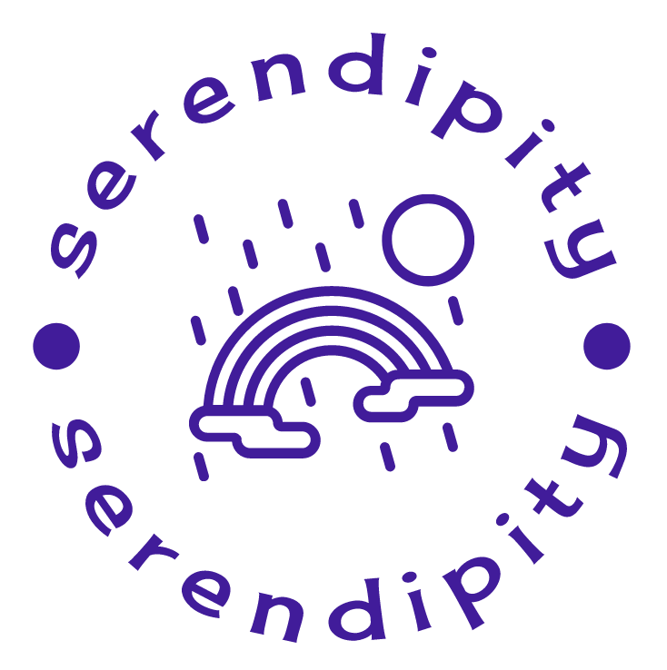

<!-- Improved compatibility of back to top link: See: https://github.com/othneildrew/Best-README-Template/pull/73 -->
<a name="readme-top"></a>
<!--
*** Thanks for checking out the Best-README-Template. If you have a suggestion
*** that would make this better, please fork the repo and create a pull request
*** or simply open an issue with the tag "enhancement".
*** Don't forget to give the project a star!
*** Thanks again! Now go create something AMAZING! :D
-->


<!-- PROJECT SHIELDS -->
<!--
*** I'm using markdown "reference style" links for readability.
*** Reference links are enclosed in brackets [ ] instead of parentheses ( ).
*** See the bottom of this document for the declaration of the reference variables
*** for contributors-url, forks-url, etc. This is an optional, concise syntax you may use.
*** https://www.markdownguide.org/basic-syntax/#reference-style-links
-->

<!-- PROJECT LOGO -->
<br />
<div align="center">
  <a href="https://github.com/vilma-l/selfcareapp">
    
  </a>

<h3 align="center">Serendipity - Selfcare App</h3>

  <p align="center">
    A React Native app for your selfcare needs: mood, sleep and daily routine tracking and motivating affirmations to make your day better!
    <br />
  </p>
</div>


<!-- TABLE OF CONTENTS -->
<details>
  <summary>Table of Contents</summary>
  <ol>
    <li>
      <a href="#about-the-project">About The Project</a>
      <ul>
        <li><a href="#built-with">Built With</a></li>
      </ul>
    </li>
    <li>
      <a href="#getting-started">Getting Started</a>
      <ul>
        <li><a href="#prerequisites">Prerequisites</a></li>
        <li><a href="#installation">Installation</a></li>
      </ul>
    </li>
    <li><a href="#usage">Usage</a></li>
    <li><a href="#license">License</a></li>
    <li><a href="#contact">Contact</a></li>
  </ol>
</details>


<!-- ABOUT THE PROJECT -->
## About The Project

This app was created as a final project for Haaga-Helia's Mobile Programming -course (5 ECTS) in November and December of 2023. It is a solo project of a 2nd year IT-student.

The main idea was to create a mobile app, where the user can log and track their mood, sleep and daily routines. The app also includes motivating affirmations to cheer the user up every time they open the app.

On this page, you will find information and instructions on the created mobile app, called Serendipity.

<p align="right">(<a href="#readme-top">back to top</a>)</p>


### Built With

* <a href="https://expo.dev/">Expo</a>
* <a href="https://reactnative.dev/">React Native</a>
* <a href="https://docs.expo.dev/versions/latest/sdk/sqlite/">Expo SQLite</a>
* <a href="https://firebase.google.com/docs/auth">Firebase Authentication</a>
* <a href="https://date-fns.org/docs/Getting-Started/">date-fns</a>

<p align="right">(<a href="#readme-top">back to top</a>)</p>


<!-- GETTING STARTED -->
## Getting Started

The app operates on both Android and iOS. Below are the instructions for you to get a local copy of the app up and running.

### Prerequisites

Install npm (see below or follow <a href="https://docs.npmjs.com/getting-started">these</a> instructions)
* npm
  ```sh
  npm install npm@latest -g
  ```

Install Expo CLI (see below or follow <a href="https://docs.expo.dev/get-started/installation/">these</a> instructions)
* Expo CLI
  ```sh
  npm install --global expo-cli
  ```

### Installation

1. Clone the repository
   ```sh
   git clone https://github.com/vilma-l/selfcareapp.git
   ```
2. Get into the project:
   ```
   cd selfcareapp
   ```
3. Install NPM packages
   ```sh
   npm install
   ```
3. Start expo
   ```sh
    expo start
   ```

<p align="right">(<a href="#readme-top">back to top</a>)</p>


<!-- USAGE EXAMPLES -->
## Usage

Use this space to show useful examples of how a project can be used. Additional screenshots, code examples and demos work well in this space. You may also link to more resources.

_For more examples, please refer to the [Documentation](https://example.com)_

<p align="right">(<a href="#readme-top">back to top</a>)</p>


<!-- LICENSE -->
## License

Distributed under the MIT License. See `LICENSE.txt` for more information.

<p align="right">(<a href="#readme-top">back to top</a>)</p>


<!-- CONTACT -->
## Contact

<a href="https://github.com/vilma-l">Vilma Laurila</a>

<a href="https://github.com/vilma-l/selfcareapp">Link to the project</a>

<p align="right">(<a href="#readme-top">back to top</a>)</p>
